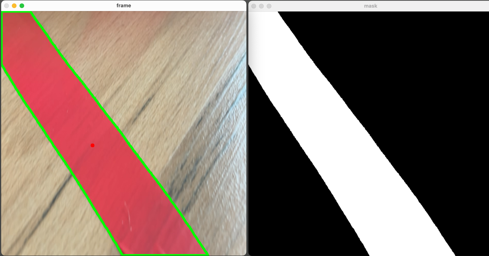

# Toy Robot Controller Using iPhone Camera

This project involves controlling a toy robot via Bluetooth LE, using image processing techniques from the iPhone camera. The main challenge was figuring out the correct communication protocol for controlling the robot's motors.

## Overview

The project integrates several components:
- **iPhone Camera**: Utilized as a webcam via Continuity Camera.
- **Bluetooth LE**: Connection to the toy robot.
- **OpenCV**: For image processing to determine the robot's direction.

## Features

- **Real-time Image Processing**: Captures video frames from the iPhone camera, preprocesses them, and identifies the direction of movement based on the presence of red color in the frame.
- **Bluetooth LE Communication**: Sends movement commands to the toy robot based on the processed image data.

## Getting Started

1. **Install Dependencies**:
    ```bash
    pip install opencv-python matplotlib numpy asyncio bleak
    ```

2. **Run the Script**:
    ```bash
    python line_follower.py
    ```

### Note

Getting started with this project might not be straightforward for everyone, as it involves using specific hardware. However, the core principles and code should work for any device with Bluetooth LE connection. Ensure to examine and adjust the format of the writes to match your specific device's requirements.


## Example

Visualization of a detected line


Video
